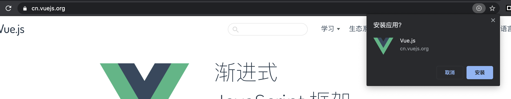
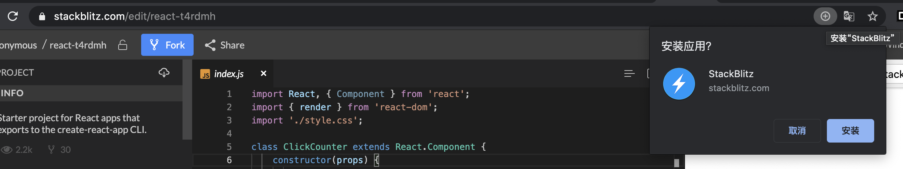
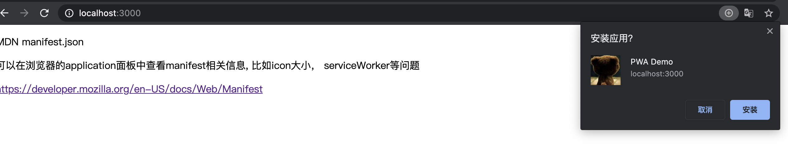

# 渐进增强web应用的实现

抽象的含义，直接用图来说明:

如何实现，在用chrome打开[Vue]官网，或者[stackblitz](https://stackblitz.com/edit/react-t4rdmh)等网站时，输入栏右边的加号功能，“点击安装xxx”?

### 实现原理

1. html5 离线应用(old)
2. PWA, link manifest.json 与 serviceWorker

### 实现效果

